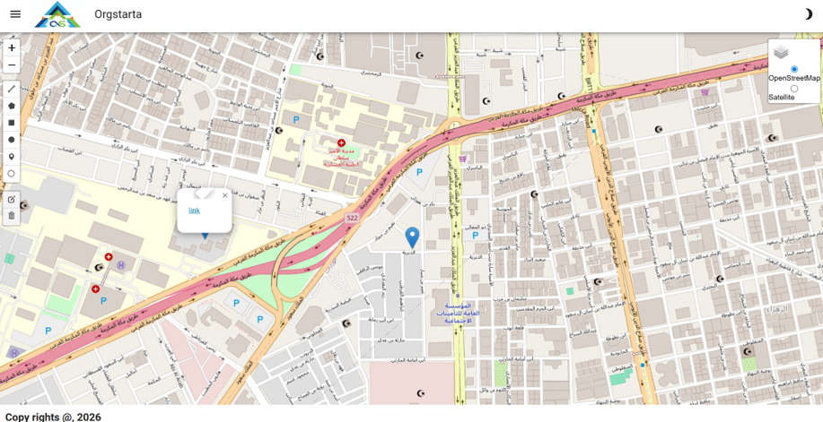
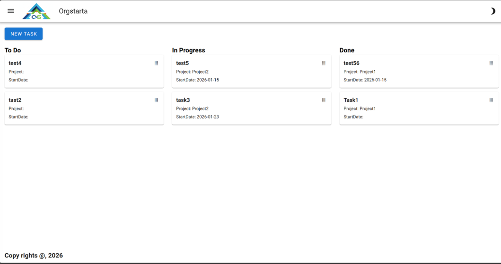
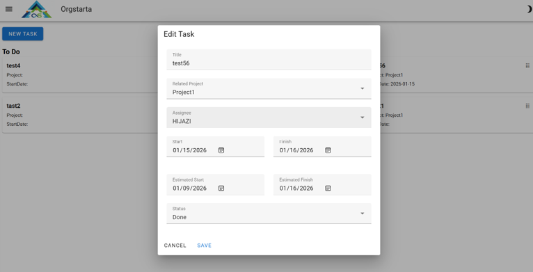
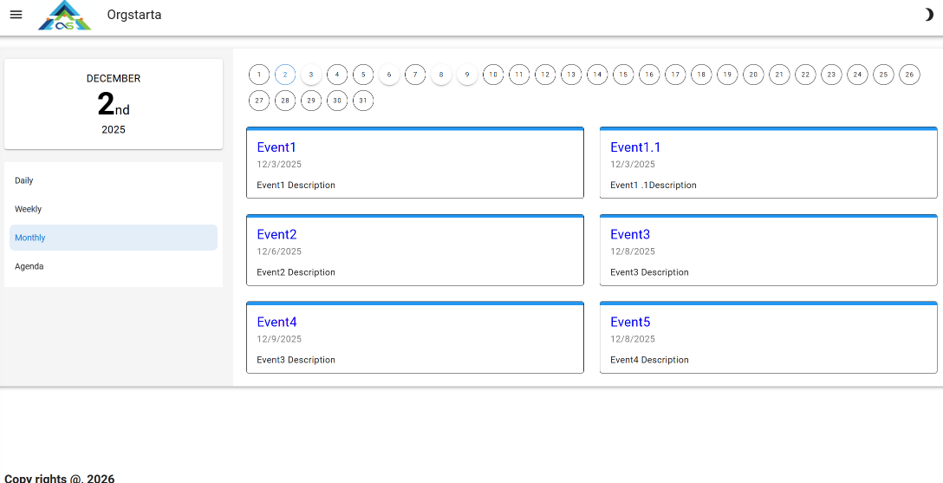
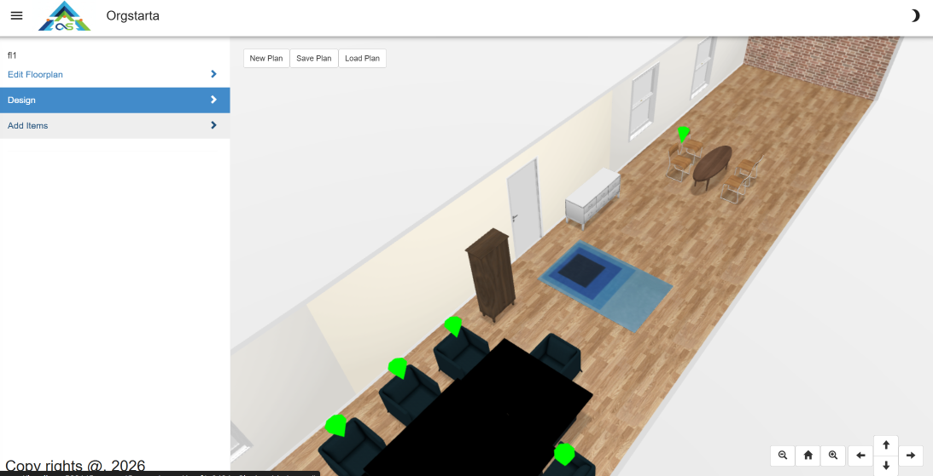
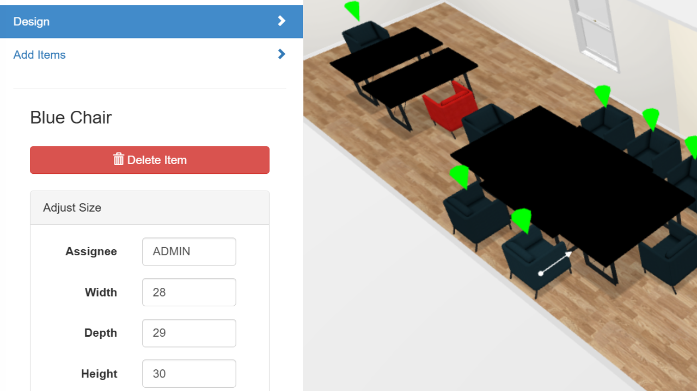

# orgstrata
orgstrata.com

# OrgStrata

Interactive organizational mapping tool.

## 🌍 Live Demo
[OrgStrata Website](https://mohamadssl.me)

## 🖼️ Preview

Orgstrata is an open‑source initiative designed to give organizations a live, transparent, and unified view of their entire operational landscape—Business, Applications, Data, and Technology.It acts as a singBusinessle source of truth, connecting to existing systems like ERP and CRM, while also supporting small organizations that may not have enterprise tools. With minimal data entry, Orgstrata visualizes the full organizational hierarchy:Company → Branches → Floors → Employees → Tasks → Projects → Milestones → KPIs → Goals → Cost → ROIOrgstrata empowers leaders, teams, and stakeholders to understand the present state of the organization instantly—without waiting for reports, consultants, or manual spreadsheets.

## 📦 Repository
This project is hosted on GitHub:  
[github.com/mohamadhijazi/orgstrata](https://github.com/mohamadhijazi/orgstrata)

1. Organizations operate in silosBusiness, IT, HR, Finance, and Operations often use disconnected toolsData is fragmented, outdated, or manually maintainedDecisions rely on assumptions instead of real‑time insights2. Lack of transparency slows growthLeaders cannot see the true status of projects, KPIs, or ROITeams struggle to align goals with executionSmall companies lack affordable tools to manage their structure3. Traditional enterprise tools are expensive and rigidERP/CRM systems are powerful but not designed for holistic visualizationCustom dashboards require heavy development and maintenanceSMEs cannot justify the cost or complexity4. Organizations need a living digital blueprintA real‑time map of people, processes, systems, and outcomesA way to track performance, cost, and value creationA transparent environment that supports governance and accountabilityOrgstrata solves all of this by providing a unified, open, extensible platform

## 🚀 Platform Overview

### 1. Open‑Source Core Platform
- Modular, extensible architecture  
- Plugin and connector ecosystem  
- Community‑driven governance and contributions  

### 2. Data Integration Layer
- Connectors for ERP, CRM, HR, Finance, and custom systems  
- API‑based ingestion for structured and unstructured data  
- Lightweight manual entry interface for small businesses  

### 3. Organizational Modeling Engine
- Dynamic hierarchy builder (Company → Branch → Floor → Team → Employee)  
- Relationship mapping for tasks, projects, KPIs, and goals  
- Real‑time updates with versioning  

### 4. Visualization & Insights Layer
- Interactive dashboards  
- Performance, cost, and ROI heatmaps  
- Project and milestone tracking  
- KPI and goal alignment views  
- Drill‑down navigation from company level to individual employee  

### 5. Governance & Transparency Framework
- Role‑based access control  
- Audit trails and change logs  
- Data quality scoring  
- Clear ownership of business units, applications, and KPIs  

### 6. Deployment Options
- Cloud, on‑premise, or hybrid  
- Docker‑based deployment  
- Multi‑tenant support for consulting firms or holding companies  

### 7. Community & Ecosystem
- Open documentation  
- Developer SDK for building connectors  
- Marketplace for templates, dashboards, and industry models  

